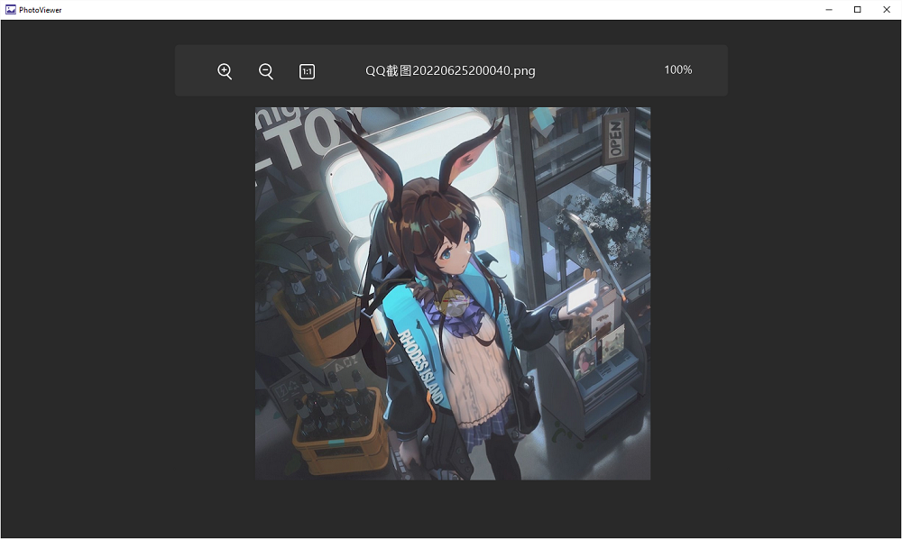
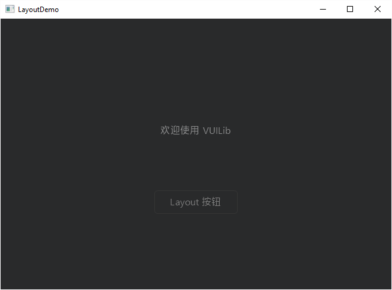
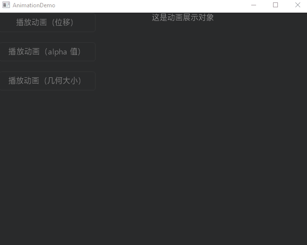

# VuiLib 

## Installation - 安装
### Requirements - 必要条件
* x64 编译
* Windows Vista and up
* C11  and up
### Steps - 安装过程
1. 找到你的 VS 的 include 路径（例如 C:\Program Files (x86)\Microsoft Visual Studio 14.0\VC\include)。
2. 将 Library 中的文件全部复制到你的 include 路径，安装完成。
## Features - 特点
* 基于 EasyX 和 Gdiplus，编译出的程序体积极小。
* 库文件简单，开包即用。
* 可用于写些打发时间的小程序。
* 自带一个美观的 UI 样式。
* 自带一个信号槽系统，整个 UI 由事件驱动。
## Visuals - 视觉效果

## Support - 支持
可在 GitHub 中提交 issues 来取得支持和帮助
## Demo - 实例程序
详见目录下 Demo 文件夹
## Development - 开发
待补充...
## License - 开源协议
本仓库所有源代码均使用 MIT License 开源协议