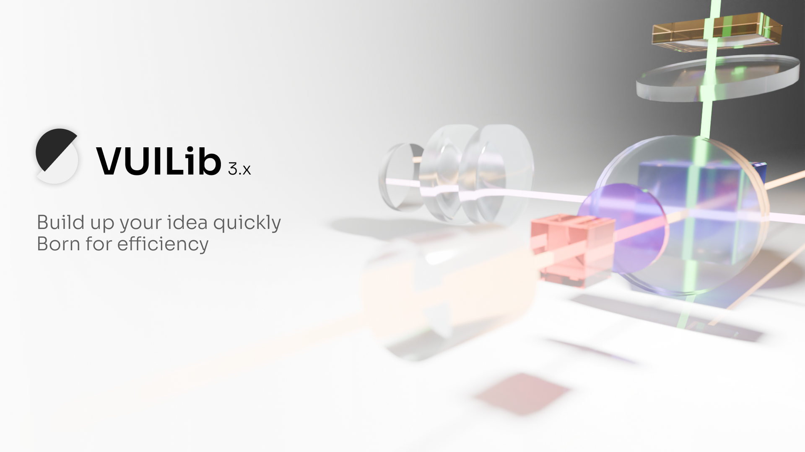

<h3 align="center">VUILib3.x</h3>
A cross-platform UI Library born for Welcome to flexible and efficient. Build with:

VUILib 3.x is still under developing, please wait with our first dev release!

