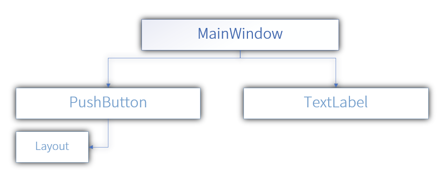

# VML 标记语言帮助文档

## 前言
VML (VUILib Markup Language) 是 VUILib 中用于描述界面的标记语言，其语法上兼容 XML，可以将 VML 理解为一个阉割版的 XML，以此快速上手 VML，这里放出一个 VML 的范例代码
```XML
<!--  TestLayoutLanguage.vlayout.xml -->
<MainWindow Type="VMainWindow" Width="1113" Height="680" Title="TestVLayoutLanguage">
    <!-- Create a Push Button -->
    <PushButton Type="VPushButton" Width="110" Height="80" Text="TestPushButton">
        <!-- Set a Layout For Push Button -->
        <Layout Type="VLayout" VerticalLayoutMode="LayoutModeCenter"
                               HorizontalLayoutMode="LayoutModeCenter">
        </Layout>
    </PushButton>

    <!-- Create a Text Label -->
    <TextLabel Type="VTextLabel" Width="100" Height="40" Text="Hello World!" X="0" Y="0" TextSize="20">

    </TextLabel>
</MainWindow>
```

## VML 的树结构

VML 文档是一颗 “树” 的结构由其根 (VMainWindow) 开始，然后生长出很多的树枝，其实在 VUILib C++ 中，所有的对象也是以对象树的形式储存的，下面有一张图可以很清楚的解释对象之间的关系。

这是前言的代码的树状结构图，这样，就较为清楚的解释了对象之间的关系已经 VML 的基本知识 - “对象树”。
在 VML 中，通过代码前的 \t 缩进数量来体现树的层次，此点可见前言的范例代码
## VML 和 XML 
VML 是在 XML 的语法上进行了删减，其主要删减内容为：
* 取消命名空间语法
* 取消 XML 的声明（尽管这是可选的，但是如果在 VML 中尝试添加声明将会引发语法错误）
* 取消了 XML 中的 CDATA 设计
* VML 中的元素是没有文本内容的

## VML 的基础结构
一个 VML 元素必须由：<br>
1. ControlID
2. ControlType

ControlID 即为 VML 元素名，ControlType 即为元素属性中的 Type 属性，ControlID 为 C++ 层获取 VML 对象的唯一识别符，例如下面的代码获取 MainWindow 元素下一个 PushButton 元素并转换为 C++ 层的 VPushButton 且绑定按钮的单击事件。<br><br>
VML Code
```XML
<MainWindow Type="VMainWindow" Width="1113" Height="680" Title="TestVLayoutLanguage">
    <!-- Create a Push Button -->
    <PushButton Type="VPushButton" Width="110" Height="80" Text="TestPushButton">
    </PushButton>
</MainWindow>
```
C++ Code
```C++
// Method 1
VMLWidget->Get(L"MainWindow").Get(L"PushButton").Get<VPushButton>()->ButtonPushed.Connect(VMLButtonOnClicked);
// Method 2
(*VMLWidget)[L"MainWindow"][L"PushButton"].Get<VPushButton>()->ButtonPushed.Connect(VMLButtonOnClicked);
// Method 3
((VPushButton*)((VUIObject*)(*VMLWidget)[L"MainWindow"][L"PushButton"]))->ButtonPushed.Connect(VMLButtonOnClicked);
```
<br>
至此，你已经对于 VML 有了一定的了解，此文档也是只是对 VML 的简单介绍，更多的 VML 使用范例，您可以在 Demo 中的 VMLWidget 下查看。