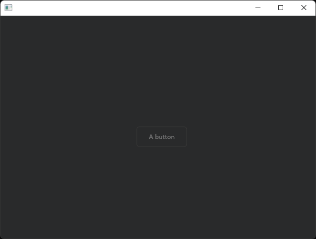
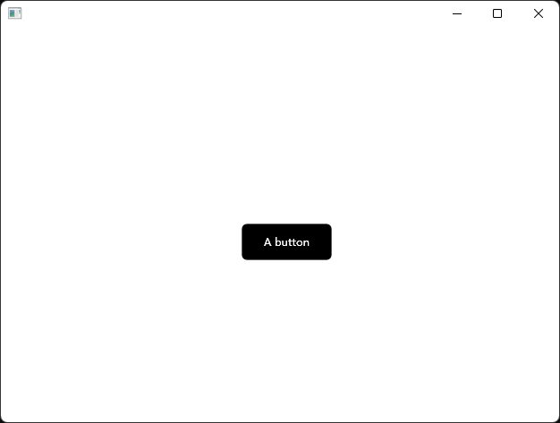
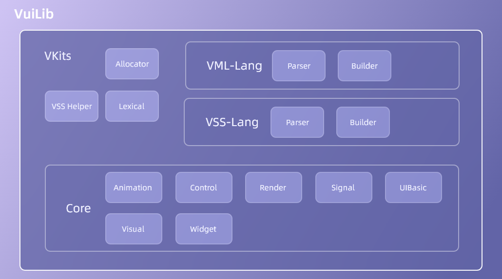

# 关于 VuiLib
最后修改日期•2022/12/19
-------
本文档将会介绍 VuiLib，其为 Windows 平台下轻度 UI 程序编写提供了另一种可能。

## 什么是 VuiLib
VuiLib 是一个基于 Direct2D 的适用于 Windows<sup>1</sup> 平台的 UI 库，其提供了两种开发方式供开发者选择。

VuiLib 主要适用于下列人员：

* 需要小规模的 UI 呈现的小型项目。
* 需要快速、轻便为程序搭建出用户交互界面的小型项目。

## 为什么使用 VuiLib
* 两种开发方式供选择，可以轻便快捷的实现。
* 编译出来的可执行文件极小，且无须过多的配置，仅需加入头文件和实现文件，您也可以自己编译静态连接版的 vuilib。
## VuiLib 的两种开发模式
在 VuiLib 中有两种开发模式，分别为 “C++ & VWidget” 和 “C++ & VML & VSS”。

* ## C++ & VWidget 开发模式
    C++ & VWidget 开发模式是指直接调用 C++ 层的 VuiLib API，而不依赖 VML 和 VSS 进行界面的辅助开发，一个 C++ & VWidget 程序不包括 VML 和 VSS 部分，例如下面是一个非常简单的使用 C++ & VWidget 模式进行开发的示例：
    ```CPP
    #include <core/object/vapplication.h>
    #include <core/widget/vwidget.h>
    #include <core/control/vpushbutton.h>

    void ButtonOnClicked() {
	    MessageBox(NULL, L"按钮被按下", L"按钮被按下", MB_OK);
    }

    int main() {
    	Core::VApplication App;
    	Core::VMainWindow  MainWindow(640, 480, &App);
    	Core::VPushButton  PushButton(100, 40, L"A button", &MainWindow);

    	PushButton.Move(MainWindow.GetWidth()  / 2 - PushButton.GetWidth()  / 2,
    					MainWindow.GetHeight() / 2 - PushButton.GetHeight() / 2);
    	PushButton.ButtonPushed.Connect(ButtonOnClicked);

    	return App.Exec();
    }
    ```
    运行上面的 Demo，会有如下的效果：

    <div align="center">
    </img>
    </div>
    C++ & VWidget 开发模式的优点：

    * 可以直接使用 C++ 开发，没有过多的学习成本。

    C++ & VWidget 开发模式的缺点：

    * 布局方面非常局限，不方便更快捷地实现布局。
    * 界面的样式设置十分繁琐，不方便界面自定义。

* ## C++ & VML & VSS 开发模式
    C++ & VML & VSS 开发模式是指借助 VML & VSS 语言，来替代 C++ 进行界面部署和部分事件绑定，而 C++ 注重于界面后端逻辑的一种开发方式（类似 MVVM 模式），使用此种开发模式能够更加方便地进行界面描述，让 C++ 层更好的处理后端逻辑，下面是一个使用 C++ & VML & VSS 开发模式实现界面的一个 Demo：

    文件：mainui.xml
    ```XML
    <main-widget type="mainwindow" width="640" height="480" class="main-window"  style-sheet-src="./style.css">
        <button type="pushbutton" x="@center" y="@center" width="100" height="40" text="A button" class="button" on-clicked="@ButtonOnClicked">
        </button>
    </main-widget>
    ```
    文件：style.css
    ```CSS
    .main-window {
        background-color: #ffffff;
    }
    .button {
        background-color: #000000;
        border-color: #000000;
        color: #ffffff;
    }
    .button:hover {
        background-color: #000000;
        border-color: #ffffff;
        color: #ffffff;
    }
    .button:active {
        background-color: #000000;
        border-color: #ffffff;
        color: #f1f1f1;
    }
    ```
    文件：main.cpp
    ```CPP
    #include <core/vml/vmlwidget.h>

    void ButtonOnClicked() {
        MessageBox(NULL, L"按钮被按下", L"按钮被按下", MB_OK);
    }

    int main() {
        Core::VApplication App;
	    VML::VMLMainWindow MainWindow(&App);

        MainWindow.RegisterMetaFunction(VML_META_FUNCTION(ButtonOnClicked));
        MainWindow.LoadVML(L"./mainui.xml", VML::VMLParserParseMode::FromFile);

        MainWindow.Show();

	    return App.Exec();
    }
    ```

    运行上面的 Demo，就可以得到下面的效果：

    <div align="center">
    </img>
    </div>

    C++ & VML & VSS 开发模式的优点：

    * 快速编写界面。
    * 可以自定义美观的个性化界面。

    C++ & VML & VSS 开发模式的缺点：

    * 对于编写者的要求很高，不仅需要了解 VuiLib，并且要求其能掌握 XML 语言与 VML 扩展特性。

## VuiLib 架构图
VuiLib 是高度模块化的，每个功能都由不同的模块组成，这样方便了后续维护与用户根据自己需要自行剔除不需要的模块，下图反映了 VuiLib 的模块结构与依赖关系：
<div align="center">
</img>
</div>

每一个模块在 VuiLib 中都有一个独立的命名空间，（VML-Lang，VSS-Lang 的命名空间分别为 VML 和 VSS，VuiLib 的命名空间默认关闭），尽管是相互依赖的模块，也只是使用对方模块暴露的接口，因此，VuiLib 可以被轻松的扩展，迭代，同时，这也方便了将任意一个 VuiLib 模块独立出来使用。

_______________________________________________________________
^1：对于 Windows 版本的支持，一般取决于该系统是否支持 Direct2D，依据<a href="https://learn.microsoft.com/zh-cn/windows/win32/direct2d/direct2d-portal#run-time-requirements">微软官方文档</a>的解释，受到 Direct2D 支持的操作系统有：

* Windows 7 或 Windows Vista 与 Service Pack 2 (SP2) 和 Platform Update for Windows Vista 及更高版本。

* Windows Server 2008 R2 或 Windows Server 2008 和 Service Pack 2 (SP2) 和 Platform Update for Windows Server 2008 及更高版本。
  