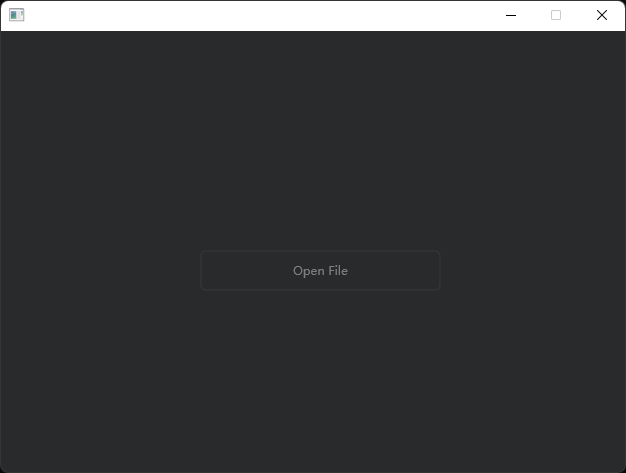
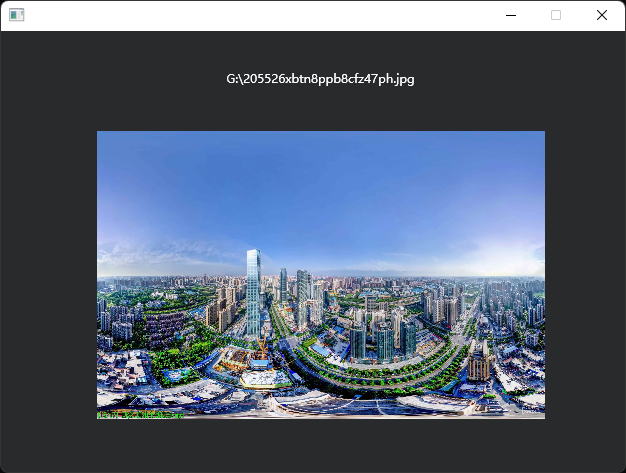

# VuiLib 的 QuickStart
最后修改日期•2022/12/20
-------
本文档将会带您快速上手 VuiLib 中的C++ & VWidget 开发模式，本教程将会以一个简单的 demo 为开始，使用两种开发方式实现同一个 demo，点击照片打开一个窗口选择图片，并在窗口里缩放显示，demo 的效果如下：
<div align="center">

</img>


</img>
</div>

## 使用 C++ & VWidget 开发模式开发
### STEP 1 ：导入 VuiLib 和需要的头文件
VuiLib 的头文件位置因人而异，此处默认以 include 文件夹内为根路径，除此以外我们还需要引入 shobjidl 调用 IFileDialog 接口，代码如下：
```CPP
#include <core/widget/vwidget.h>
#include <core/widget/vtextlabel.h>
#include <core/widget/vimagelabel.h>
#include <core/widget/vpushbutton.h>

#include <shobjidl.h>
```

### STEP 2 ：编写 main 入口
在 VuiLib 中，需要一个 VApplication 类来进行一个全局消息循环，一般而言，main 的返回值应该由 VApplication::Exec 函数来接管，所以我们可以构建下面的 main 函数框架：
```CPP
int main() {
    Core::VApplicaiton App;

    // Your Code Here

    return App.Exec();
}
```

### STEP 3 ：继承 VMainWindow 类来编写自己的窗口
在 VuiLib 中创建一个窗口，一般地使用继承 VuiLib 现有的窗口类，然后再窗口类中实现自己的逻辑代码（事实上，并不是所有场景都适用这种写法），这里，我们的类名取为 “SimpleDemo”，由于并没有考虑到布局的问题，所以窗口并不应该可以被用户缩放，注意到 VMainWindow 的构造函数如下：
```CPP
VMainWindow::VMainWindow(const int& Width, const int& Height, VApplication* Parent, const bool& Sizble = true)
```
故我们只需要将 Sizble 由默认的 true 设置为 false 即可，下为代码：
```CPP
class SimpleDemo : public Core::VMainWindow {
public:
    // 构造 VMainWindow 对象并设置窗口不可缩放
    SimpleDemo(Core::VApplication* AppParent) : VMainWindow(640, 480, AppParent, false) {

        // 将窗口设为可见
        Show();
    }
}
```
然后我们修改刚刚编写好的 main 函数，将我们的 SimpleDemo 类添加进去，代码如下：
```CPP
int main() {
    Core::VApplicaiton App;
    SimpleDemo         MainWindow(&App);

    return App.Exec();
}
```
> ● 注意
> 
>     继承 VMainWindow 进行窗口编写并不是强制性，这也不是唯一的使用 VuiLib 的方法，不同的开发方式各有优劣，而对于多种方式的优劣，此处不展开讨论。
### STEP 4 ：增加控件并设置样式与布局
接下来，我们增加我们所需要的控件，分析上面效果，我们需要的控件有：按钮、图形 Label、文字 Label，所以我们在 SimpleDemo 类中添加一个私有成员为我们所需要的控件，代码如下：
```CPP
class SimpleDemo {
...

private:
    Core::VTextLabel*  FileName;
    Core::VImageLabel* ImageLabel;
    Core::VPushButton* FileOpenButton;
}
```
由于 VImageLabel 需要提供一个 VImage 对象作为显示对象，所以还需要创建一个 VImage 对象：
```CPP
class SimpleDemo {
...

private:
    Core::VImage*      ViewImage;
    Core::VTextLabel*  FileName;
    Core::VImageLabel* ImageLabel;
    Core::VPushButton* FileOpenButton;
}
```
然后，我们需要在 SimpleDemo 的构造函数中初始化控件，并设置他们的样式与布局：
```CPP
SimpleDemo(Core::VApplication* AppParent) : VMainWindow(640, 480, AppParent, false) {
    // 初始化图片对象
	ViewImage	   = nullptr;
    // 文字 Label 对象
	FileName	   = new Core::VTextLabel(640, 20, this);
    // 图片 Label 对象
	ImageLabel	   = new Core::VImageLabel(640 * 0.7, 480 * 0.6, ViewImage, this);
    // 打开文件按钮对象
	FileOpenButton = new Core::VPushButton(240, 40, L"Open File", this);


    // 设置文件名样式
	FileName->SetTextColor(Core::VColor::White);                                    // 字体颜色为白
	FileName->SetLineAlignment(Core::VFontAlignment::DWRITE_TEXT_ALIGNMENT_CENTER); // 文字居中


    // 设置布局
	FileName->Move(0, 40);
	FileOpenButton->Move(GetWidth() / 2 - FileOpenButton->GetWidth() / 2, GetHeight() / 2 - FileOpenButton->GetHeight() / 2);
	ImageLabel->Move(GetWidth() / 2 - ImageLabel->GetWidth() / 2, 100);

    // 展示窗口
	Show();
}
```
### STEP 5 ：完成按钮点击后的信号逻辑
首先，定义一个信号回调函数<sup>1</sup>：
```CPP
void OpenFile() {
    // Your codes
}
```
由于使用 IFileDialog 接口并不是 quickstart 的中心问题，故此处不赘述，直接给出代码：
```CPP
PWSTR  FilePath = new WCHAR[MAX_PATH];

HRESULT OperationResult;
std::thread FileDialogThread([](LPWSTR FilePath, HRESULT* OperationResult) -> void {
    CoInitialize(NULL);
    IFileDialog* FileDialog = NULL;
    HRESULT	     Status = CoCreateInstance(CLSID_FileOpenDialog, NULL, CLSCTX_INPROC_SERVER, IID_PPV_ARGS(&FileDialog));
    DWORD		 OptionFlags;

    COMDLG_FILTERSPEC FileFilter[] = { { L"All files", L"*.*" }, };

    FileDialog->GetOptions(&OptionFlags);
    FileDialog->SetOptions(OptionFlags | FOS_FORCEFILESYSTEM);
    FileDialog->SetFileTypes(ARRAYSIZE(FileFilter), FileFilter);
    FileDialog->SetFileTypeIndex(1);

    *OperationResult = FileDialog->Show(NULL);

    FileDialog->ClearClientData();
    FileDialog->Close(*OperationResult);
    if (SUCCEEDED((*OperationResult))) {
        IShellItem* SellItem;

        FileDialog->GetResult(&SellItem);
        LPWSTR OpenPath;

        SellItem->GetDisplayName(SIGDN_DESKTOPABSOLUTEPARSING, &OpenPath);
        SellItem->Release();

        CoTaskMemFree(OpenPath);

        FileDialog->ClearClientData();
        FileDialog->Close(*OperationResult);
        wcscpy_s(FilePath, MAX_PATH, OpenPath);
    }

    FileDialog->Release();

    CoUninitialize();
}, FilePath, &OperationResult);
FileDialogThread.join();
```
在调用 IFileDialog 获取文件路径以后，我们首先要检查其是否是一个可以被 VuiLib 正常加载的图片文件，而 VImage 中的 VImage::IsValidBitmapFile 就为我们提供了这种功能，但注意，VImage::IsValidBitmapFile 是一个静态函数，再确认其可以被正常加载以后，我们再把该文件加载到 VImage 中。

值得一提的是，有关于任何渲染相关的设备（例如图片，笔刷，字体），都需要提供一个渲染上下文<sup>2</sup>来声明，而在 VUIObject::CallWidgetGetDCRenderTarget 中提供了一个获取我们所需要的句柄的方法。

而对于一开始用户用于打开文件的按钮，在正确加载图像以后已经没有任何用处，此处应该将其隐藏，即调用 VUIObject::Hide 方法，并且在调用 VImageLabel::SetImage 设置展示对象，和 VTextLabel::SetPlaneText 设置文件路径显示。

综上所述，最终代码如下：
```CPP
// IFileDialog 操作成功并且文件合法
if (SUCCEEDED(OperationResult) && Core::VImage::IsValidBitmapFile(FilePath)) {
    // 加载文件到 VImage 对象中
	ViewImage = new Core::VImage(FilePath, CallWidgetGetDCRenderTarget());
	
    // 隐藏按钮
	FileOpenButton->Hide();
	
    // 设置显示图片
	ImageLabel->SetImage(ViewImage);
    // 设置文字为文件路径
	FileName->SetPlaneText(FilePath);
}
```
最后，我们再绑定按钮的点击事件，我们修改 SimpleDemo 的构造函数，VPushButton 类有一公开成员 OnPushed，此即为按钮的点击事件实例<sup>3</sup>，调用 VSignal::Connect 方法来绑定事件：
```CPP
FileOpenButton->ButtonPushed.Connect(this, &SimpleDemo::OpenFile);
```
最后结合起来，即可完成 demo 的效果了（完整代码可在 demo/quick-start-cpp-width-vwidget 中查看）。
______________________
^1 ：即为信号被触发以后需要调用的函数。

^2 ：即为 VRenderHandle，关于渲染句柄的讨论，此处不做展开，将会在其他文档中单独细讲。

^3 ：即为一个 VSignal 对象。